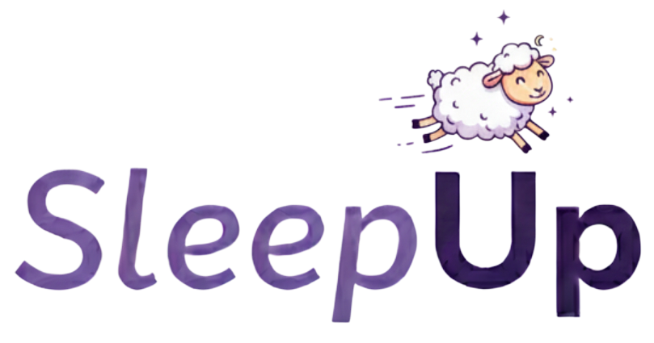
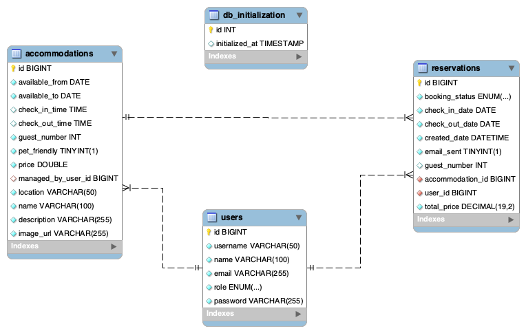

# 💤 SleepUp — Backend API

**SleepUp** is a backend application designed to manage accommodations and reservations in a secure, scalable environment.  
It is built with **Java 21** and **Spring Boot 3.5.5**, featuring **JWT-based authentication**, **Redis token blacklisting**, **Cloudinary image storage**, **email notifications**, and robust CI/CD pipelines.  
The API includes stateless session handling, Swagger-based documentation, and clear domain separation for maintainability.

---

## 📋 Index
- [🗝 Key Features](#key-features-)
    - [Security and Authentication 🔒](#security-and-authentication-)
    - [User Management 👥](#user-management-)
    - [Accommodation Management 🏨](#accommodation-management-)
    - [Reservation Management 📅](#reservation-management-)
    - [API Documentation 📜](#api-documentation-)
    - [Exception Handling ⚠️](#exception-handling-)
- [👩‍💻 Technology Stack](#technology-stack-)
- [📁 Clone the Repository](#clone-the-repository-)
    - [Run 🏃‍♂️](#run-)
- [📚 API Endpoints](#-api-endpoints)
    - [Authentication](#authentication)
    - [Users](#users)
    - [Accommodations](#accommodations)
    - [Reservations](#reservations)
- [🧪 Running Tests](#running-tests-)
- [🚀 CI/CD Pipeline](#cicd-pipeline)
   - [Detailed Workflows](#detail-workflows)
- [📦 Diagrams](#diagrams-)
- [🐳 Docker](#docker)
- [☸️ Kubernetes](#kubernetes)
- [👥 Contributors](#contributors-)

---

## 🗝 Key Features

### Security and Authentication 🔒
- Stateless authentication using **JWT + Refresh Tokens**
- Role-based access control: `USER` and `ADMIN`
- Route protection with JWT Bearer tokens
- **Token blacklisting** using Redis
- Email notifications:
    - Confirmation upon user registration
    - Notification on specific actions (e.g., reservation reminders)

---

### User Management 👥
- Register and log in users
- Access and update personal profiles
- Admin-only features:
    - View all registered users
    - Update user details and roles
    - Delete users

---

### Accommodation Management 🏨
- Full **CRUD** for accommodations
- Users manage their own listings
- Admins can manage all accommodations
- Store images using **Cloudinary**
- Filter by **name**, **location**, **price range**, **guest capacity**, and **pet-friendly**
- Pagination and sorting supported

---

### Reservation Management 📅
- Users can create, update, and cancel reservations
- Owners can confirm or reject reservations
- Filter reservations by **time period**: ALL, PAST, FUTURE
- Pagination and status tracking

---

### API Documentation 📜
- Integrated with **Swagger UI** for easy API exploration and testing.

---

### Exception Handling ⚠️
- Global exception handling using `@ControllerAdvice` (`GlobalExceptionHandler`)
- Clear and structured error messages
- Covers validation, authorization, and domain-specific exceptions

---

## 👩‍💻 Technology Stack

| Component        | Technology        | Version | Purpose                        |
|------------------|-------------------|---------|--------------------------------|
| Framework        | Spring Boot       | 3.5.5   | Main application framework     |
| Runtime          | Java              | 21      | Runtime environment            |
| Database         | MySQL             | Latest  | Persistent data storage        |
| Caching          | Redis             | Latest  | Token blacklist                |
| Security         | Spring Security   | 6.x     | Authentication & authorization |
| JWT              | JJWT              | 0.12.6  | Token generation & validation  |
| Email            | Spring Mail       | 3.5.5   | Email notifications            |
| Images           | Cloudinary        | 2.0.0   | Image storage & management     |
| Documentation    | SpringDoc OpenAPI | 2.8.9   | API documentation              |
| Mapping          | MapStruct         | 1.5.5   | Entity-DTO transformations     |
| Testing          | Spring Boot Test  | 3.5.5   | Unit & integration testing     |
| Containerization | Docker            | Latest  | Application containers         |
| Orchestration    | Kubernetes        | Latest  | Container orchestration        |

---

## 📁 Clone the Repository

```bash
git clone https://github.com/Femcoders-SleepUp/SleepUp.git
cd SleepUp
```

### Run 🏃‍♂️

```bash
  ./mvnw spring-boot:run
```
or
```bash
  mvn spring-boot:run
```

> 💡 Alternatively, run the main application class (annotated with `@SpringBootApplication`) directly from your IDE, e.g., IntelliJ IDEA → right-click → **Run 'SuApplication.main()'**.

---

## 📚 API Endpoints

### 🔐 Authentication

| Method | Endpoint         | Description                     |
| ------ | ---------------- | ------------------------------- |
| `POST` | `/auth/register` | 🆕 Register a new user          |
| `POST` | `/auth/login`    | 🔑 Log in and receive JWT token |
| `POST` | `/auth/logout`   | 🚪 Invalidate current token     |
| `POST` | `/auth/refresh`  | ♻️ Refresh expired token        |

---

### 👤 Users
| Method   | Endpoint               | Description                    |
| -------- | ---------------------- | ------------------------------ |
| `GET`    | `/users/profile`       | 👀 Get current user profile    |
| `PUT`    | `/users/profile`       | ✏️ Update current user profile |
| `DELETE` | `/users/profile`       | ❌ Delete current user account  |
| `POST`   | `/users/upload-avatar` | 🖼️ Upload avatar image        |

---

### 🏡Accommodations
| Method   | Endpoint                 | Description                              |
| -------- | ------------------------ | ---------------------------------------- |
| `GET`    | `/accommodations`        | 🌍 List all accommodations               |
| `GET`    | `/accommodations/{id}`   | 🔍 Get accommodation details             |
| `GET`    | `/accommodations/filter` | 🧭 Filter accommodations with pagination |
| `POST`   | `/accommodations`        | ➕ Create a new accommodation *(User)*    |
| `PUT`    | `/accommodations/{id}`   | 🛠️ Update accommodation *(Owner)*       |
| `DELETE` | `/accommodations/{id}`   | 🗑️ Delete accommodation *(Owner)*       |

---

### 📅Reservations
| Method   | Endpoint             | Description                 |
| -------- | -------------------- | --------------------------- |
| `GET`    | `/reservations`      | 📄 List user’s reservations |
| `GET`    | `/reservations/{id}` | 🔎 Get reservation details  |
| `POST`   | `/reservations`      | ✍️ Create new reservation   |
| `PUT`    | `/reservations/{id}` | 🛠️ Update reservation      |
| `DELETE` | `/reservations/{id}` | ❌ Cancel reservation        |

---

## 🧪 Running Tests
- Tests run in a dedicated **MySQL test database**
- Configured with SQL scripts (`schema.sql` and `data.sql`) for isolation
- External services (Cloudinary, email) mocked for reliability

```bash
  ./mvnw test
```

---

## ## 🚀 CI/CD Pipeline

Our project includes a complete **CI/CD pipeline powered by GitHub Actions**, ensuring code quality, automated testing, and reliable deployments across all development stages.

---

### 🧩 **Workflow Overview**

| Workflow                      | File          | Purpose                               | Trigger                 | Main Actions                                       |
| ----------------------------- | ------------- | ------------------------------------- | ----------------------- | -------------------------------------------------- |
| ✅ **Automated Tests**         | `test.yml`    | Validate Pull Requests before merging | On Pull Request         | Runs test suite using Docker + MySQL + Redis       |
| ⚙️ **Continuous Integration** | `ci.yml`      | Ensure code stability and integration | Push to `main` or `dev` | Compiles, tests, and validates build artifacts     |
| 🐳 **Docker Build & Publish** | `build.yml`   | Build and publish Docker images       | Push / Manual           | Creates and uploads optimized images to GHCR       |
| 🏷️ **Release Pipeline**      | `release.yml` | Create production releases            | Tag `v*.*.*`            | Runs full tests, builds, changelog, and release    |
| ☸️ **Kubernetes Deployment**  | `deploy.yml`  | Deploy app to Kubernetes cluster      | Manual / After release  | Updates configuration and performs rolling updates |

---

### 🔍 **Detailed Workflow Descriptions**

#### 🧪 1️⃣ `test.yml` — Automated Testing on Pull Requests
**Purpose:** Validate code changes before merging to main branch.  
**Process:**
- Spins up **MySQL** and **Redis** containers for integration tests.
- Runs `mvn test` using isolated Docker environments.
- Generates **coverage reports** and feedback.
- Ensures no defective code reaches the main branch.

---

#### ⚙️ 2️⃣ `ci.yml` — Continuous Integration
**Purpose:** Maintain stability of main and dev branches.  
**Process:**
- Sets up **JDK 21** and caches dependencies.
- Executes `mvn clean compile` and `mvn test`.
- Validates successful builds and ensures no regressions.
- Keeps stable and production-ready codebases.

---

#### 🐳 3️⃣ `build.yml` — Docker Build & Publish
**Purpose:** Generate and publish containerized application images.  
**Process:**
- Uses **Docker Buildx** for multi-architecture image builds.
- Logs in to **GitHub Container Registry (GHCR)**.
- Extracts version metadata and tags automatically.
- Publishes lightweight, optimized Docker images.

---

#### 🏷️ 4️⃣ `release.yml` — Release Automation
**Purpose:** Create official releases with changelogs and version tags.  
**Process:**
- Detects new semantic version tags (e.g., `v1.2.3`).
- Builds production artifacts and Docker images.
- Publishes a **GitHub Release** with autogenerated notes.
- Uploads versioned images to GHCR.

---

#### ☸️ 5️⃣ `deploy.yml` — Kubernetes Deployment
**Purpose:** Automate deployment to Kubernetes clusters.  
**Process:**
- Configures access to Kubernetes cluster.
- Applies **ConfigMaps** and **Secrets**.
- Deploys MySQL, Redis, and the application.
- Performs **rolling updates** with zero downtime.
- Verifies pod health and ingress configuration.

---

### 🔄 **Complete CI/CD Flow**

```text
┌─────────────────┐
│  Pull Request   │
└────────┬────────┘
         │
         ▼
┌─────────────────┐
│   test.yml      │ ◄─── Validate changes using Docker
└────────┬────────┘
         │ [Merge]
         ▼
┌─────────────────┐
│   main/dev      │
└────────┬────────┘
         │
         ▼
┌─────────────────┐
│    ci.yml       │ ◄─── Continuous Integration
└────────┬────────┘
         │
         ▼
┌─────────────────┐
│   build.yml     │ ◄─── Build and push Docker image
└────────┬────────┘
         │
         ▼
┌─────────────────┐
│   Tag Release   │
└────────┬────────┘
         │
         ▼
┌─────────────────┐
│  release.yml    │ ◄─── Generate release artifacts
└────────┬────────┘
         │
         ▼
┌─────────────────┐
│  deploy.yml     │ ◄─── Deploy to Kubernetes cluster
└─────────────────┘

```
### 📊 Status Badges
Keep visibility of your pipeline status:
- 
- 
- 
- 

---
## 📦 ER Diagram

Entity-relationship overview of database schema


---
## 🐋 **Docker**

The project includes **full Docker support** with an optimized setup:


### 🏗️ Dockerfile
- **Multi-stage image** optimized for production:
  - Compiles the application in a **builder image**
  - Generates an **executable JAR**
  - Creates a **minimal runtime image with JRE 21**
  - Exposes **port 8080**

### 📦 Docker Compose
For local development, includes:
- **SleepUp** application service
- **MySQL** database
- **Redis** cache
- Internal network for inter-service communication

```bash
  docker-compose up -d
```
---
## ☸️ Kubernetes

Manifests for production deployment:

#### 📄 Included Resources

- deployment.yaml → Defines the application deployment

- service.yaml → Service to expose the application

- configmap.yaml → Non-sensitive configuration

- kustomization.yaml → Resource management with Kustomize

### ⚡ Deployment
```
kubectl apply -k kubernetes/
```
---

## 👥 Contributors

<table> <tr> <td align="center"> <a href="https://github.com/brunasonda">  <br /> <sub><b>Bruna Sonda</b></sub> </a> </td> <td align="center"> <a href="https://github.com/isanort">  <br /> <sub><b>Iris Sánchez</b></sub> </a> </td> <td align="center"> <a href="https://github.com/PCalvoGarcia">  <br /> <sub><b>Paula Calvo</b></sub> </a> </td> <td align="center"> <a href="https://github.com/PaolaAPL17">  <br /> <sub><b>Paola Pinilla</b></sub> </a> </td> <td align="center"> <a href="https://github.com/thaisrqueiroz">  <br /> <sub><b>Thais Rocha</b></sub> </a> </td> </tr> </table>